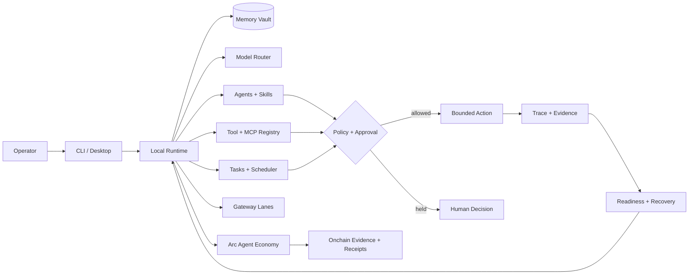

<p align="center">
  
</p>

<h1 align="center">Hallow</h1>

<p align="center"><strong>The local Agent OS for autonomous work.</strong></p>

<p align="center">
  Persistent memory · Model routing · Bounded tools · Tested skills · Long-running tasks · Human approval · Recovery
</p>

<p align="center">
  <a href="https://hallow-agent.xyz">Website</a> ·
  <a href="https://hallow-agent.xyz/arc">Arc Agent Economy</a> ·
  <a href="./docs/INSTALL.md">Install guide</a> ·
  <a href="./docs/PRODUCTION_READINESS.md">Readiness</a> ·
  <a href="./SECURITY.md">Security</a>
</p>

<p align="center">
  
  
  
  <a href="./LICENSE"></a>
</p>

---

Hallow installs an AI agent runtime on the user's computer. It keeps its workspace, memory, task history, traces, policies, and desktop surfaces local by default while allowing the operator to choose local or cloud intelligence.

It is designed for work that should survive a chat session: inspect a repository, reuse project context, run bounded tools, schedule tasks, pause for approval, recover from failure, and return evidence the operator can inspect.

> Hallow is an alpha release. It is useful for real local testing, but it is not yet a hardened isolation boundary for arbitrary untrusted code. Read [Current limits](#current-limits) before using it with sensitive systems.

## Install in one command

### Windows PowerShell

```powershell
iex (irm https://hallow-agent.xyz/install.ps1)
```

### macOS, Linux, WSL2, or Termux

```bash
curl -fsSL https://hallow-agent.xyz/install.sh | bash
```

The installer downloads a release snapshot, builds against the lockfile, runs `hallow doctor`, creates the launcher, starts the managed local service, and opens the desktop. Git and Corepack are not required. Existing runtime state under `~/.hallow/` is preserved during updates.

Inspect an installer before running it:

```powershell
irm https://hallow-agent.xyz/install.ps1 -OutFile install.ps1
.\install.ps1 -DryRun
```

```bash
curl -fsSL https://hallow-agent.xyz/install.sh -o install.sh
bash install.sh --dry-run
```

## Start in five minutes

```bash
hallow
hallow doctor
hallow model setup
hallow open
hallow chat "Inspect this workspace, explain its architecture, and propose the next safe task."
```

`hallow` opens the operator shell. Direct commands remain available in any terminal.

```text
hallow> status
hallow> skills hub
hallow> run "turn my weekly repository review into a reusable workflow"
hallow> sessions
hallow> exit
```

<p align="center">
  
</p>

## What makes it an Agent OS

| System layer | What Hallow provides | Why it matters |
| --- | --- | --- |
| Local runtime | Managed service, CLI, desktop, docs, and local HTTP API | The agent lives where the work lives instead of inside one browser tab. |
| Memory vault | SQLite, Markdown, JSONL mirror, local index, tree view, and export | Context can survive sessions while remaining inspectable and user-controlled. |
| Model router | Multiple local and cloud routes with health checks and fallback profiles | A workflow is not owned by one model provider. |
| Tool boundary | Registered file, web, browser, shell, MCP, and domain tools | Agents receive explicit capabilities instead of ambient machine access. |
| Skills and agents | Manifests, permissions, verification, tests, reflection, and promotion | Expertise can be packaged, reused, audited, and improved. |
| Durable work | Task queue, schedules, checkpoints, retries, cancellation, and branching | Work can continue beyond a single model response. |
| Approval and traces | Risk lanes, approval queue, tool traces, readiness, and security audit | Sensitive actions remain attributable to a reason and an operator decision. |
| Recovery | Health checks, reactive repair, supervised heal loops, and readiness proof | Failure becomes evidence for controlled recovery instead of a silent reset. |
| Gateways | Pairing, allowlists, send modes, inbox/outbox, and local webhooks | External conversations enter through governed lanes. |

## Architecture



The model is one component inside this system. Memory, policy, tool permissions, approval, and evidence are runtime responsibilities rather than prompt conventions.

<p align="center">
  
</p>

## One mission, end to end

```bash
hallow chat "Audit my launch repository. Repair the broken release, write the notes, and ask before publishing."
```

Hallow can:

1. recall relevant project memory;
2. scope the workspace and available tools;
3. create a durable task and checkpoint;
4. inspect, repair, and test inside the configured boundary;
5. stop an external publish at the approval queue;
6. resume with the approved identifier; and
7. preserve the result as a trace and conversation history.

The exact behavior depends on the selected agent, tools, model route, sandbox backend, and local policy.

## Hallow for Arc: work, prove, settle

[Hallow for Arc](https://hallow-agent.xyz/arc) turns a local agent runtime into a policy-governed economic participant. Arc provides agent identity, job contracts, deterministic finality, and USDC settlement; Hallow keeps execution, private memory, tools, evidence, and approval under the operator's control.

| Layer | Responsibility |
| --- | --- |
| Identify | Inspect ERC-8004 agent ownership and metadata without treating registration as trust. |
| Contract | Bind provider, evaluator, budget, expiry, and scope into an ERC-8183-compatible job intent. |
| Execute | Perform the work locally with bounded tools and private memory. |
| Verify | Require evidence commitments and an evaluator independent from the provider and client. |
| Settle | Produce a tamper-evident Work Receipt suitable for USDC settlement verification. |

```bash
hallow arc status
hallow arc contracts
hallow arc agent 42
hallow arc plan-job --provider 0x... --evaluator 0x... --budget 20 \
  --description "Analyze public transactions" --evidence 0x... --provider-registered

hallow economy status
hallow economy inspect https://service.example/report
hallow economy autopilot https://service.example/report \
  --purpose "Buy one independently verified report"
```

The current Arc integration is testnet-only. Network and contract verification, Agent Passport reads, deterministic job policy, x402 discovery, bounded payment intents, append-only local commerce ledger, exact approvals, and tamper-evident receipts are implemented. Transaction signing and production settlement are deliberately not enabled.

Read the [Arc Agent Economy architecture](./docs/ARC_AGENT_ECONOMY.md).

## Core commands

```bash
# runtime
hallow status
hallow readiness
hallow doctor
hallow start
hallow open
hallow stop

# work
hallow chat "message"
hallow sessions list
hallow task list
hallow schedule list

# capability
hallow agent list
hallow skill hub
hallow tool list
hallow mcp discover
hallow model health

# control
hallow approval list
hallow security audit
hallow sandbox status
hallow autonomy heartbeat --dry-run
hallow gateway status
```

Run `hallow --help` for the complete command surface.

## Local state and privacy

Hallow writes runtime state to `~/.hallow/` by default.

```text
~/.hallow/
├── .env                       # local secrets; never commit
├── config.yaml
├── memory/                    # SQLite, Markdown, index, tree
├── models/                    # providers and routing
├── mcp/                       # registered MCP servers
├── gateway/                   # channels, pairings, inbox/outbox
├── tasks/                     # durable work queue
├── cron/                      # schedules
├── traces/                    # inspectable execution evidence
├── policies/                  # security and sandbox configuration
├── marketplace/               # installed package metadata
└── desktop/                   # local operator UI and docs
```

Credentials stay in the local environment. Public receipts and site demonstrations must never contain API keys, prompts, private memory, seed phrases, wallet secrets, local runtime addresses, or developer infrastructure details.

## Build from source

Requirements: Node.js 22+ and Corepack.

```bash
git clone https://github.com/Hallow-agent/Hallow.git
cd Hallow
corepack enable
corepack pnpm install --frozen-lockfile
corepack pnpm build
corepack pnpm hallow --home .hallow-dev setup
corepack pnpm hallow --home .hallow-dev start
```

Validate the repository:

```bash
corepack pnpm test
corepack pnpm installer:check
corepack pnpm audit:prod
```

## Current limits

Hallow `0.3.0` is an alpha release.

- The installed runtime begins on the operator's machine, but cloud models and remote tools send the data required for their calls to the provider selected by the operator.
- Sandbox strength depends on the configured backend and host operating system. Do not treat the default runtime as a hardened boundary for hostile code.
- The public marketplace is package metadata and local sources, not yet a hosted trustless registry.
- Messaging and OAuth adapters require operator-owned credentials and configuration.
- Arc transaction signing is disabled. Its public experience verifies the network, registries, agent identity, and dry-run job policy.
- Native desktop packaging and stronger process isolation remain roadmap items.

See [Production Readiness](./docs/PRODUCTION_READINESS.md), [Security](./SECURITY.md), and the [0.3.0 release notes](./docs/RELEASE_0.3.0.md).

## Repository map

```text
packages/core       shared paths, manifests, filesystem, and policy primitives
packages/models     provider catalog, routing, health, and generation adapters
packages/chain      Arc identity, job policy, evidence, and receipt primitives
packages/runtime    local server, memory, tools, tasks, desktop, and gateways
packages/cli        installer-facing and operator command surface
site                hallow-agent.xyz static website and product media
docs                architecture, install, audits, releases, and product design
examples            example agents and reusable skills
scripts             public installers, checks, and media renderers
```

## Documentation

- [Install guide](./docs/INSTALL.md)
- [Arc Agent Economy](./docs/ARC_AGENT_ECONOMY.md)
- [Production readiness](./docs/PRODUCTION_READINESS.md)
- [Security policy](./SECURITY.md)
- [Comparison and design context](./docs/COMPARISON.md)
- [Blueprint](./BLUEPRINT.md)
- [Changelog](./CHANGELOG.md)
- [Contributing](./CONTRIBUTING.md)

## License

Hallow is released under the [MIT License](./LICENSE).

---

<p align="center"><strong>Your machine. Your memory. Your agent.</strong></p>
