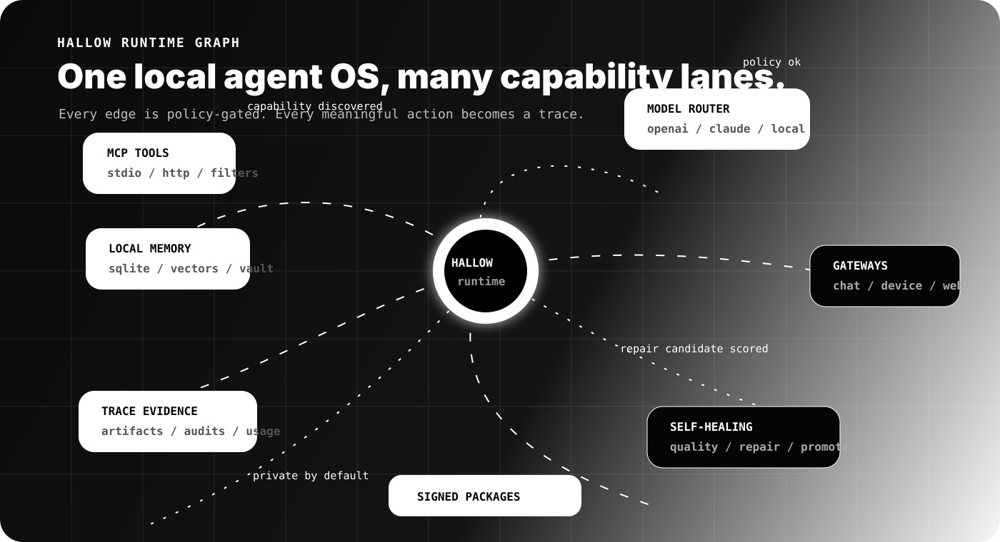

# Hallow



**Hallow is a local-first agent OS for autonomous AI agents.**

It is not a chatbot wrapper, not a landing-page demo, and not a cloud account that owns your memory. Hallow installs a private runtime on the user's machine, then gives agents one standard for memory, tools, model routing, signed skills, gateway lanes, traces, readiness checks, and self-healing loops.

```bash
curl -fsSL https://hallow-agent.xyz/install.sh | bash
```

```powershell
irm https://hallow-agent.xyz/install.ps1 | iex
```

> Windows note: use PowerShell for the `.ps1` installer. Use the bash installer only inside WSL, Git Bash, macOS, Linux, or Termux.

## Why Hallow Exists

Most agent projects are powerful in one lane:

- A desktop personal AI with memory.
- A tool runner with MCP.
- A multi-agent orchestration framework.
- A gateway for chat platforms.
- A model router.
- A scheduler.

Hallow tries to make those lanes feel like one installable agent OS. The platform website stays simple. The work happens locally.



## First Run

```bash
hallow terminal
hallow setup
hallow doctor
hallow start
```

Then open:

```text
http://127.0.0.1:4767/desktop
```

The terminal is part of the product, not an afterthought:



## What Makes Hallow Different

| Layer | Hallow approach |
| --- | --- |
| Local-first runtime | The agent OS runs on the user's machine. Memory, traces, package metadata, and desktop artifacts begin local. |
| Agent standard | Agents and skills use manifests, permissions, model needs, package signatures, and verification checks. |
| MCP surface | MCP stdio and HTTP servers can be registered, filtered, and surfaced to agents through policy. |
| Model routing | Routes can target OpenAI-compatible APIs, Claude-style providers, OpenRouter, Groq, DeepSeek, local Ollama, LM Studio, vLLM, and fallback profiles. |
| Memory vault | SQLite, JSONL, Markdown, local vector index, memory tree, and Obsidian-style export live under the Hallow home. |
| Self-healing loop | Failed or low-quality runs become traces, metrics, reflection drafts, repair candidates, and promotion decisions. |
| Gateway lanes | Local webhook, browser, chat, device, and future messaging channels use pairing, allowlists, and send-mode policy. |
| Security posture | Tool registry, approval queue, sandbox profile, API token guard, package signing, and security audit are first-class runtime checks. |
| Demo proof | `hallow readiness`, `hallow doctor`, `hallow security audit`, and `hallow demo checklist` produce concrete evidence instead of vague claims. |

## Compared With Other Agent Projects

| Inspiration | What they do well | Hallow's angle |
| --- | --- | --- |
| OpenHuman | Personal AI, local memory, human-centered desktop UX. | Hallow focuses on a broader agent OS standard: packages, runtime checks, gateways, tools, and model routes. |
| Hermes | Clean installer, terminal identity, skills, web/browser/tool power. | Hallow borrows the spirit of simple install, then adds signed agent/skill metadata, readiness proof, and local product docs. |
| Aeon | Autonomy, scheduler, skill repair, long-running loops. | Hallow puts autonomy beside memory, MCP, marketplace, gateway, security, and model routing in one local runtime. |
| OpenClaw | Multi-channel gateways, device pairing, browser/API routing. | Hallow treats gateway lanes as one part of a larger local agent OS, with policy and trace evidence attached. |
| LangGraph / CrewAI | Durable workflows and multi-agent collaboration. | Hallow can sit above orchestration frameworks as the local shell, package standard, memory surface, and operator runtime. |

## Install From Source

```bash
git clone https://github.com/Hallow-agent/Hallow.git
cd Hallow
corepack enable
corepack pnpm install --frozen-lockfile
corepack pnpm build
corepack pnpm hallow --home .hallow-dev setup
corepack pnpm hallow --home .hallow-dev terminal
```

## Core Commands

```bash
hallow terminal
hallow setup
hallow doctor
hallow readiness
hallow start
hallow agent create research
hallow skill hub
hallow mcp discover
hallow model health
hallow gateway status
hallow security audit
hallow autonomy heartbeat --dry-run
```

## Runtime Surfaces

| Surface | Purpose |
| --- | --- |
| CLI | Builder/operator surface for install, agents, memory, tools, models, autonomy, security, and gateway commands. |
| Desktop shell | Local browser UI served by the runtime at `/desktop`. |
| Docs shell | Local docs served by the runtime at `/docs`. |
| HTTP API | Local automation surface for readiness, desktop status, tools, memory, models, gateways, and tasks. |
| Static site | Public face at `https://hallow-agent.xyz`. |

## Runtime State

By default Hallow writes private runtime state to:

```text
~/.hallow/
```

Useful local files include:

```text
config.yaml
memory/global.sqlite
memory/MEMORY.md
memory/index.yaml
memory/tree.yaml
models/providers.yaml
models/routing.yaml
mcp/servers.yaml
gateway/channels.yaml
tasks/queue.yaml
cron/jobs.yaml
traces/*.yaml
policies/security-audit.yaml
policies/sandbox.yaml
marketplace/index.yaml
usage/ledger.jsonl
desktop/index.html
desktop/docs/index.html
```

Secrets stay in the user's local runtime home:

```text
~/.hallow/.env
```

Example variable names:

```bash
OPENROUTER_API_KEY=
OPENAI_API_KEY=
ANTHROPIC_API_KEY=
```

## Current Status

Hallow `001` (`0.0.1`) is the first public preview. It is ready for local-first installation and real testing, with future releases planned for native installer, hosted registry, deeper sandboxing, richer gateway adapters, stronger desktop UX, and more autonomous loops.

The current build includes:

- CLI installer flow.
- Local runtime server.
- Desktop and docs shell.
- Readiness and doctor checks.
- Memory vault and local index.
- MCP registry and tool filtering foundation.
- Agent and skill package verification.
- Signed marketplace metadata.
- Model catalog and routing.
- Gateway registry with pairing/allowlist policy.
- OAuth and web-auth profile definitions.
- Autonomy tick, loop, heartbeat, quality, reactive repair, and heal commands.
- Security audit, sandbox profile, approval queue, and API token guard.

See [CHANGELOG.md](./CHANGELOG.md) for release notes.

Next production jumps:

- Native desktop installer.
- Harder process isolation for untrusted packages.
- Hosted public package registry.
- Richer gateway adapters.
- Live provider onboarding.
- More visual desktop UX.

## Documentation

- [Install guide](./docs/INSTALL.md)
- [Demo mode](./docs/DEMO_MODE.md)
- [Comparison](./docs/COMPARISON.md)
- [Gap closure](./docs/GAP_CLOSURE.md)
- [Perfect build checklist](./docs/PERFECT_BUILD.md)
- [Production readiness](./docs/PRODUCTION_READINESS.md)
- [Security policy](./SECURITY.md)
- [Blueprint](./BLUEPRINT.md)

## Project Shape

```text
packages/core      shared filesystem, YAML, paths, manifests
packages/models    model catalog, provider registry, routing
packages/runtime   local agent OS runtime and HTTP shell
packages/cli       hallow command line
site               static public website for hallow-agent.xyz
docs               launch docs, audits, comparison, and roadmap
examples           example agents and signed skills
scripts            public install scripts
```

## The Short Pitch

Hallow is an attempt to make autonomous agents feel installable, inspectable, and standard. Humans should not have to manually babysit every agent loop. They should be able to run a local agent OS, inspect what it did, trust its boundaries, and decide what becomes public.
